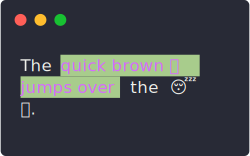

# tty-strings

[](https://www.npmjs.com/package/tty-strings)
[](https://github.com/luciancooper/tty-strings/actions/workflows/ci.yml)
[](https://codecov.io/gh/luciancooper/tty-strings)
[](#license)

A one stop shop for working with text displayed in the terminal.

## About

The goal of this project is to alleviate the headache of working with Javascript's internal representation of unicode characters, particularly within the context of displaying text in the terminal for command line applications.

**Features**

* Implements the Unicode grapheme cluster breaking algorithm outlined in [UAX #29](https://unicode.org/reports/tr29/#Grapheme_Cluster_Boundaries) to split strings into user perceived characters (graphemes).
* Accurately measures of the visual width of strings when they are displayed in the terminal, with support for emoji characters and [ZWJ sequences](https://unicode.org/reports/tr51/#Emoji_ZWJ_Sequences). More details about the visual width of code points can be found in the [`codePointWidth`](#codepointwidthcode) function description below.
* Provides methods for slicing and wrapping strings that contain [ANSI escape codes](https://en.wikipedia.org/wiki/ANSI_escape_code).

Everything in this module is up to date with the latest version of Unicode (currently version [15.1.0](https://www.unicode.org/versions/Unicode15.1.0/)).

Check out the [acknowledgements](#acknowledgements) section below for a look at the other Javascript projects that inspired this module.

## Installation

Install with `npm`:

```bash
npm install tty-strings
```

Or with `yarn`:

```bash
yarn add tty-strings
```

Then import one or more of the functions detailed in the section below.

## API

### `codePointWidth(code)`

Get the visual width of a unicode code point.

* `code` - Unicode code point (must be a `number`).

Returns `number` - `2` for a full width code point, `0` for a zero width code point, and `1` for everything else.

**Code points**

*Full width* code points are all unicode code points whose `East_Asian_Width` property value is `F` or `W`, which are derived from the [EastAsianWidth.txt](https://unicode.org/Public/UCD/latest/ucd/EastAsianWidth.txt) data file associated with [UAX #11: East Asian Width](https://unicode.org/reports/tr11/).

*Zero width* code points include all unicode code points whose `General_Category` property value is `Mn`, `Me`, or `Cc` (derived from the [DerivedGeneralCategory.txt](https://unicode.org/Public/UCD/latest/ucd/extracted/DerivedGeneralCategory.txt) data file), as well as all code points with the `Default_Ignorable_Code_Point` property, (derived from the [DerivedCoreProperties.txt](https://unicode.org/Public/UCD/latest/ucd/DerivedCoreProperties.txt) data file). Check out [UAX #44: Unicode Character Database](https://unicode.org/reports/tr44/) for more information about these properties.

**Example**

```js
const { codePointWidth } = require('tty-strings');

// The numerical code point for '古' is 53E4

codePointWidth(0x53E4);
// > 2
```

### `stringLength(string)`

Get the length of a string in grapheme clusters. ANSI escape codes will be ignored.

* `string` - Input string to measure.

Returns `number` - the length of the string in graphemes.

**Example**

```js
const { stringLength } = require('tty-strings');

'🏳️‍🌈'.length;
// > 6

stringLength('🏳️‍🌈');
// > 1
```

### `stringWidth(string)`

Get the visual width of a string. ANSI escape codes will be ignored.

* `string` - Input string to measure.

Returns `number` - the visual width of the string.

**Example**

```js
const { stringWidth } = require('tty-strings');

stringWidth('🧑🏻‍🤝‍🧑🏼');
// > 2
```

### `wordWrap(string, columns, [options])`

Word wrap text to a specified column width. Input string may contain ANSI escape codes.

* `string` - Text to word wrap.
* `columns` - Column width to wrap text to.
* `options` - Optional options object specifying the properties detailed below.

Returns `string` - the word wrapped string.

#### `options.hard`

**Type:** `boolean`\
**Default:** `false` 

By default, words that are longer than the specified column width will not be broken and will therefore extend past the specified column width. Setting this to `true` will enable hard wrapping, in which words longer than the column width will be broken and wrapped across multiple rows.

#### `options.trimLeft`

**Type:** `boolean`\
**Default:** `true`

Trim leading whitespace from the beginning of each line. Setting this to `false` will preserve any leading whitespace found before each line in the input string.

**Example**

```js
const { wordWrap } = require('tty-strings'),
    chalk = require('chalk');

const text = 'The ' + chalk.bgGreen.magenta('quick brown 🦊 jumps over') + ' the 😴 🐶.';

console.log(wordWrap(text, 20));
```

<p>
  <a id="word-wrap-example" href="#word-wrap-example">
    
  </a>
</p>

### `sliceChars(string, [beginIndex, [endIndex]])`

Slice a string by character index. Behaves like the native [String.slice()](https://developer.mozilla.org/en-US/docs/Web/JavaScript/Reference/Global_Objects/String/slice), except that indexes refer to grapheme clusters within the string, and it handles ANSI escape sequences.

 * `string` - Input string to slice.
 * `beginIndex` - Character index (defaults to `0`) at which to begin the slice. Negative values specify a position measured from the character length of the string.
 * `endIndex` - Character index before which to end the slice. Negative values specify a position measured from the character length of the string. If omitted, the slice will extend to the end of the string.

Returns `string` - the sliced string.

**Example**

```js
const { sliceChars } = require('tty-strings');

sliceChars('🙈🙉🙊', 0, 2);
// > '🙈🙉';
```

### `sliceColumns(string, [beginIndex, [endIndex]])`

Slice a string by column index. Behaves like the native [String.slice()](https://developer.mozilla.org/en-US/docs/Web/JavaScript/Reference/Global_Objects/String/slice), except that indexes account for the visual width of each character, and it handles ANSI escape sequences.

 * `string` - Input string to slice.
 * `beginIndex` - Column index (defaults to `0`) at which to begin the slice. Negative values specify a position measured from the visual width of the string.
 * `endIndex` - Column index before which to end the slice. Negative values specify a position measured from the visual width of the string. If omitted, the slice will extend to the end of the string.

Returns `string` - the sliced string.

**Example**

```js
const { sliceColumns } = require('tty-strings');

// '🙈', '🙉', and '🙊' are all full width characters

sliceColumns('🙈🙉🙊', 0, 2);
// > '🙈'
```

### `spliceChars(string, start, deleteCount, [insert])`

Insert, remove or replace characters from a string, similar to the native [`Array.splice()`](https://developer.mozilla.org/en-US/docs/Web/JavaScript/Reference/Global_Objects/Array/splice) method. String may contain ANSI escape codes; inserted content will adopt any ANSI styling applied to the character immediately preceding the insert point.

 * `string` - Input string to remove, insert, or replace characters from.
 * `start` - Character index at which to begin splicing. Negative values specify a position measured from the character length of the string.
 * `deleteCount` - The number of characters to remove from the string. If `0`, no characters will be removed from the string.
 * `insert` - Optional string to be inserted at the index specified by the `start` parameter. If omitted, nothing will be inserted into the string.

Returns `string` - the modified input string.

**Example**

```js
const { spliceChars } = require('tty-strings');

spliceChars('à̰ b̸ ĉ̥', 2, 1, 'x͎͛ÿz̯̆');
// > 'à̰ x͎͛ÿz̯̆ ĉ̥'
```

### `splitLines(string)`

Split a string with ANSI escape codes into an array of lines. Supports both `CRLF` and `LF` newlines.

 * `string` - Input string to split.

Returns `string[]` - lines in the input string.

**Example**

```js
const { splitLines } = require('tty-strings'),
    chalk = require('chalk');

splitLines(chalk.green('foo\nbar'));
// > ['\u001b[32mfoo\u001b[39m', '\u001b[32mbar\u001b[39m']
```

### `stripAnsi(string)`

Remove ANSI escape codes from a string.

* `string` - Input string to strip.

Returns `string` - the input string with all ANSI escape codes removed.

This method is adapted from chalk's [`slice-ansi`](https://github.com/chalk/slice-ansi) package, and is essentially identical.

**Example**

```js
const { stripAnsi } = require('tty-strings');

stripAnsi('\u001b[32mfoo\u001b[39m');
// > 'foo'
```

### `splitChars*(string)`

A generator function that splits a string into its component graphemes. Does not handle ANSI escape codes, so make sure to use [`stripAnsi`](#stripansistring) on any input string before calling this generator.

* `string` - Input string to split.

Yields - a `string` for each grapheme.

**Example**

```js
const { splitChars } = require('tty-strings');

[...'à̰ḇ́ĉ̥'];
// > ['a', '\u0300', '\u0330', 'b', '\u0341', '\u0331', 'c', '\u0302', '\u0325']

[...splitChars('à̰ḇ́ĉ̥')];
// > ['à̰', 'ḇ́', 'ĉ̥']
```

### `charWidths*(string)`

A generator function that splits a string into measured graphemes. Does not handle ANSI escape codes, so make sure to use [`stripAnsi`](#stripansistring) on any input string before calling this generator.

 * `string` - Input string to split.

Yields - a `[char, width]` pair for each grapheme in the string.

**Example**

```js
const { charWidths } = require('tty-strings');

// Basic latin characters

[...charWidths('abc')]
// > [['a', 1], ['b', 1], ['c', 1]]

// Full width emoji characters

[...charWidths('🙈🙉🙊')]
// > [['🙈', 2], ['🙉', 2], ['🙊', 2]]
```

## Development

Contributions are welcome!

To report a bug or request a feature, please [open a new issue](../../issues/new).

### Running Tests 

Install project dependencies and run the test suite with the following command:

```bash
yarn && yarn test
```

To generate coverage reports, run:

```bash
yarn test --coverage
```

## Acknowledgements

This project was conceived of as a single module offering improved implementations of the following Javascript packages, all of which are great projects that served as inspiration:

* [`string-width`](https://github.com/sindresorhus/string-width)
* [`string-length`](https://github.com/sindresorhus/string-length)
* [`is-fullwidth-code-point`](https://github.com/sindresorhus/is-fullwidth-code-point)
* [`wrap-ansi`](https://github.com/chalk/wrap-ansi)
* [`slice-ansi`](https://github.com/chalk/slice-ansi)

This project's internal implementation of the Unicode grapheme cluster breaking algorithm is inspired by Devon Govett's [`grapheme-breaker`](https://github.com/foliojs/grapheme-breaker) and Orlin Georgiev's [`grapheme-splitter`](https://github.com/orling/grapheme-splitter).

## License

[MIT](LICENSE)
